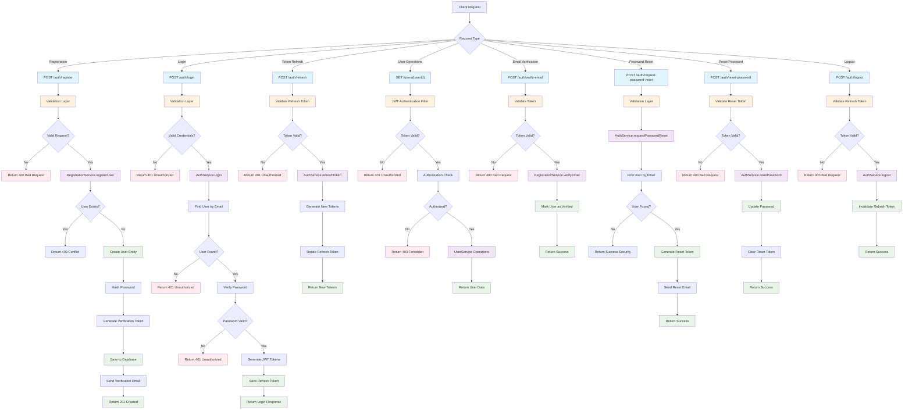
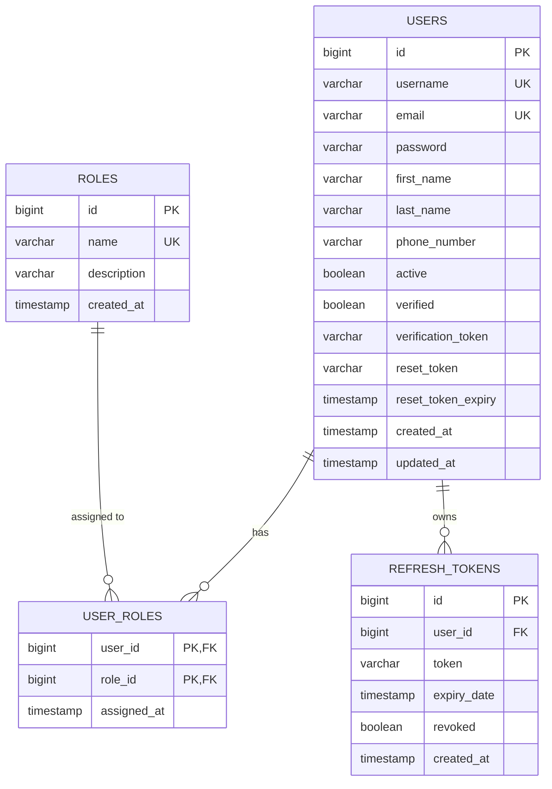
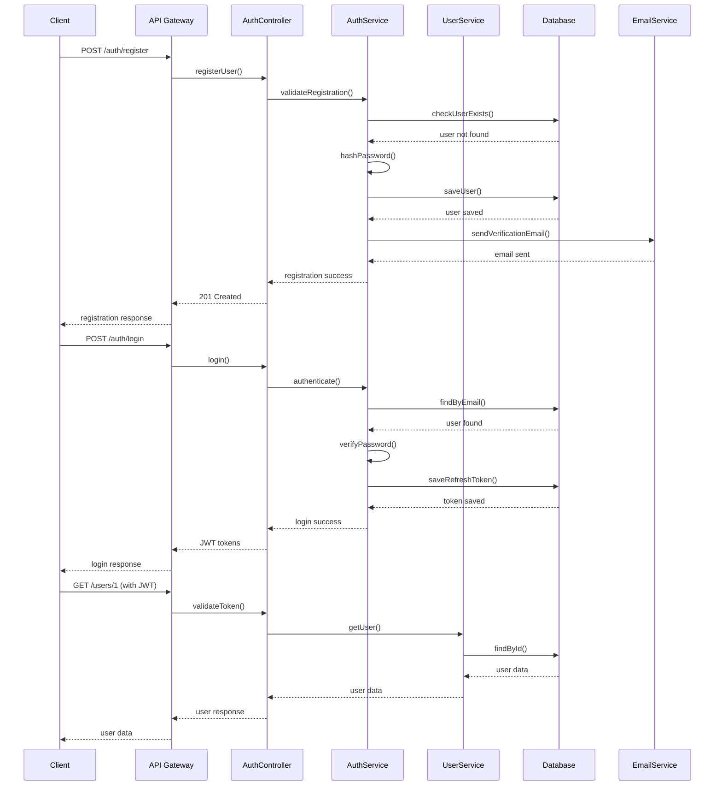
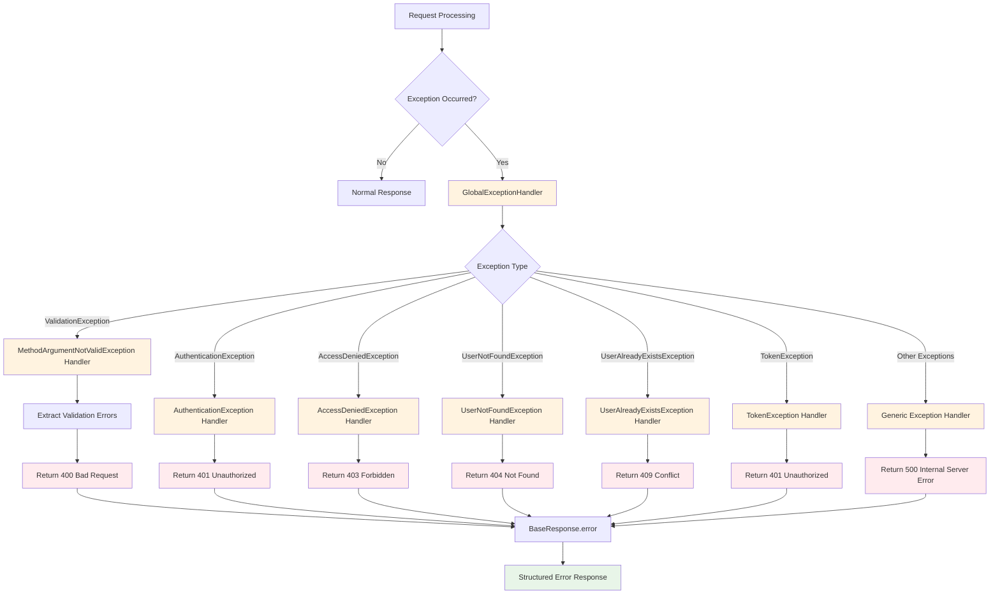

# Zaplink Auth Service Architecture

## Authentication Flow Diagram

```mermaid
flowchart TD
    A[Client Request] --> B{Request Type}
    
    %% Registration Flow
    B -->|Registration| C["POST /auth/register"]
    C --> D[Validation Layer]
    D --> E{Valid Request?}
    E -->|No| F[Return 400 Bad Request]
    E -->|Yes| G[RegistrationService.registerUser]
    G --> H{User Exists?}
    H -->|Yes| I[Return 409 Conflict]
    H -->|No| J[Create User Entity]
    J --> K[Hash Password]
    K --> L[Generate Verification Token]
    L --> M[Save to Database]
    M --> N[Send Verification Email]
    N --> O[Return 201 Created]
    
    %% Login Flow
    B -->|Login| P["POST /auth/login"]
    P --> Q[Validation Layer]
    Q --> R{Valid Credentials?}
    R -->|No| S[Return 401 Unauthorized]
    R -->|Yes| T[AuthService.login]
    T --> U[Find User by Email]
    U --> V{User Found?}
    V -->|No| W[Return 401 Unauthorized]
    V -->|Yes| X[Verify Password]
    X --> Y{Password Valid?}
    Y -->|No| Z[Return 401 Unauthorized]
    Y -->|Yes| AA[Generate JWT Tokens]
    AA --> AB[Save Refresh Token]
    AB --> AC[Return Login Response]
    
    %% Token Refresh Flow
    B -->|Token Refresh| AD["POST /auth/refresh"]
    AD --> AE[Validate Refresh Token]
    AE --> AF{Token Valid?}
    AF -->|No| AG[Return 401 Unauthorized]
    AF -->|Yes| AH[AuthService.refreshToken]
    AH --> AI[Generate New Tokens]
    AI --> AJ[Rotate Refresh Token]
    AJ --> AK[Return New Tokens]
    
    %% User Management Flow
    B -->|User Operations| AL["GET /users/{userId}"]
    AL --> AM[JWT Authentication Filter]
    AM --> AN{Token Valid?}
    AN -->|No| AO[Return 401 Unauthorized]
    AN -->|Yes| AP[Authorization Check]
    AP --> AQ{Authorized?}
    AQ -->|No| AR[Return 403 Forbidden]
    AQ -->|Yes| AS[UserService Operations]
    AS --> AT[Return User Data]
    
    %% Email Verification Flow
    B -->|Email Verification| AU["POST /auth/verify-email"]
    AU --> AV[Validate Token]
    AV --> AW{Token Valid?}
    AW -->|No| AX[Return 400 Bad Request]
    AW -->|Yes| AY[RegistrationService.verifyEmail]
    AY --> AZ[Mark User as Verified]
    AZ --> BA[Return Success]
    
    %% Password Reset Flow
    B -->|Password Reset| BB["POST /auth/request-password-reset"]
    BB --> BC[Validation Layer]
    BC --> BD[AuthService.requestPasswordReset]
    BD --> BE[Find User by Email]
    BE --> BF{User Found?}
    BF -->|No| BG["Return Success Security"]
    BF -->|Yes| BH[Generate Reset Token]
    BH --> BI[Send Reset Email]
    BI --> BJ[Return Success]
    
    %% Password Reset Confirmation
    B -->|Reset Password| BK["POST /auth/reset-password"]
    BK --> BL[Validate Reset Token]
    BL --> BM{Token Valid?}
    BM -->|No| BN[Return 400 Bad Request]
    BM -->|Yes| BO[AuthService.resetPassword]
    BO --> BP[Update Password]
    BP --> BQ[Clear Reset Token]
    BQ --> BR[Return Success]
    
    %% Logout Flow
    B -->|Logout| BS["POST /auth/logout"]
    BS --> BT[Validate Refresh Token]
    BT --> BU{Token Valid?}
    BU -->|No| BV[Return 400 Bad Request]
    BU -->|Yes| BW[AuthService.logout]
    BW --> BX[Invalidate Refresh Token]
    BX --> BY[Return Success]
    
    %% Styling
    classDef endpoint fill:#e1f5fe
    classDef service fill:#f3e5f5
    classDef validation fill:#fff3e0
    classDef database fill:#e8f5e8
    classDef error fill:#ffebee
    classDef success fill:#e8f5e8
    
    class C,P,AD,AL,AU,BB,BK,BS endpoint
    class G,T,AH,AS,AY,BD,BO,BW service
    class D,Q,AE,AM,AV,BC,BL,BT validation
    class J,M,AB,AT,AZ,BH,BP,BX database
    class F,S,W,Z,AG,AO,AR,AX,BN,BV error
    class O,AC,AK,BA,BJ,BR,BY success
```

## Security Architecture Diagram

```mermaid
flowchart LR
    %% Client Layer
    A[Client Application] --> B[HTTP Request]
    
    %% Security Filter Chain
    B --> C[Security Filter Chain]
    C --> D[JWT Authentication Filter]
    D --> E{JWT Token Present?}
    E -->|No| F[Continue as Anonymous]
    E -->|Yes| G[Validate JWT Token]
    G --> H{Token Valid?}
    H -->|No| I[Return 401 Unauthorized]
    H -->|Yes| J[Set Authentication Context]
    J --> K[Continue to Authorization]
    F --> K
    
    %% Authorization Layer
    K --> L[Authorization Manager]
    L --> M{Endpoint Public?}
    M -->|Yes| N[Access Granted]
    M -->|No| O{User Authenticated?}
    O -->|No| P[Return 401 Unauthorized]
    O -->|Yes| Q{User Authorized?}
    Q -->|No| R[Return 403 Forbidden]
    Q -->|Yes| N
    
    N --> S[Controller Layer]
    
    %% Controller Layer
    S --> T[ZaplinkAuthController]
    S --> U[UserController]
    
    %% Service Layer
    T --> V[AuthService]
    T --> W[RegistrationService]
    U --> X[UserService]
    
    %% Data Layer
    V --> Y[UserRepository]
    W --> Y
    X --> Y
    Y --> Z[Database]
    
    %% External Services
    W --> AA[Email Service]
    
    %% Styling
    classDef client fill:#e3f2fd
    classDef security fill:#ffebee
    classDef controller fill:#f3e5f5
    classDef service fill:#e8f5e8
    classDef data fill:#fff3e0
    classDef external fill:#fce4ec
    
    class A client
    class C,D,G,J,K,L,M,O,Q security
    class T,U controller
    class V,W,X service
    class Y,Z data
    class AA external
```

## Database Schema Diagram

```mermaid
erDiagram
    USERS {
        bigint id PK
        varchar username UK
        varchar email UK
        varchar password
        varchar first_name
        varchar last_name
        varchar phone_number
        boolean active
        boolean verified
        varchar verification_token
        varchar reset_token
        timestamp reset_token_expiry
        timestamp created_at
        timestamp updated_at
    }
    
    ROLES {
        bigint id PK
        varchar name UK
        varchar description
        timestamp created_at
    }
    
    USER_ROLES {
        bigint user_id PK,FK
        bigint role_id PK,FK
        timestamp assigned_at
    }
    
    REFRESH_TOKENS {
        bigint id PK
        bigint user_id FK
        varchar token
        timestamp expiry_date
        boolean revoked
        timestamp created_at
    }
    
    USERS ||--o{ USER_ROLES : "has"
    ROLES ||--o{ USER_ROLES : "assigned to"
    USERS ||--o{ REFRESH_TOKENS : "owns"
```

## Component Interaction Diagram

```mermaid
sequenceDiagram
    participant Client
    participant Gateway as API Gateway
    participant AuthController as AuthController
    participant AuthService as AuthService
    participant UserService as UserService
    participant Database as Database
    participant EmailService as EmailService
    
    %% Registration Flow
    Client->>Gateway: POST /auth/register
    Gateway->>AuthController: registerUser()
    AuthController->>AuthService: validateRegistration()
    AuthService->>Database: checkUserExists()
    Database-->>AuthService: user not found
    AuthService->>AuthService: hashPassword()
    AuthService->>Database: saveUser()
    Database-->>AuthService: user saved
    AuthService->>EmailService: sendVerificationEmail()
    EmailService-->>AuthService: email sent
    AuthService-->>AuthController: registration success
    AuthController-->>Gateway: 201 Created
    Gateway-->>Client: registration response
    
    %% Login Flow
    Client->>Gateway: POST /auth/login
    Gateway->>AuthController: login()
    AuthController->>AuthService: authenticate()
    AuthService->>Database: findByEmail()
    Database-->>AuthService: user found
    AuthService->>AuthService: verifyPassword()
    AuthService->>Database: saveRefreshToken()
    Database-->>AuthService: token saved
    AuthService-->>AuthController: login success
    AuthController-->>Gateway: JWT tokens
    Gateway-->>Client: login response
    
    %% Protected Resource Flow
    Client->>Gateway: GET /users/1 (with JWT)
    Gateway->>AuthController: validateToken()
    AuthController->>UserService: getUser()
    UserService->>Database: findById()
    Database-->>UserService: user data
    UserService-->>AuthController: user data
    AuthController-->>Gateway: user response
    Gateway-->>Client: user data
```

## Error Handling Flow

```mermaid
flowchart TD
    A[Request Processing] --> B{Exception Occurred?}
    B -->|No| C[Normal Response]
    B -->|Yes| D[GlobalExceptionHandler]
    
    D --> E{Exception Type}
    
    E -->|ValidationException| F[MethodArgumentNotValidException Handler]
    E -->|AuthenticationException| G[AuthenticationException Handler]
    E -->|AccessDeniedException| H[AccessDeniedException Handler]
    E -->|UserNotFoundException| I[UserNotFoundException Handler]
    E -->|UserAlreadyExistsException| J[UserAlreadyExistsException Handler]
    E -->|TokenException| K[TokenException Handler]
    E -->|Other Exceptions| L[Generic Exception Handler]
    
    F --> M[Extract Validation Errors]
    M --> N[Return 400 Bad Request]
    
    G --> O[Return 401 Unauthorized]
    H --> P[Return 403 Forbidden]
    I --> Q[Return 404 Not Found]
    J --> R[Return 409 Conflict]
    K --> S[Return 401 Unauthorized]
    L --> T[Return 500 Internal Server Error]
    
    N --> U["BaseResponse.error"]
    O --> U
    P --> U
    Q --> U
    R --> U
    S --> U
    T --> U
    
    U --> V[Structured Error Response]
    
    classDef handler fill:#fff3e0
    classDef response fill:#ffebee
    classDef success fill:#e8f5e8
    
    class D,F,G,H,I,J,K,L handler
    class N,O,P,Q,R,S,T response
    class V success
```
